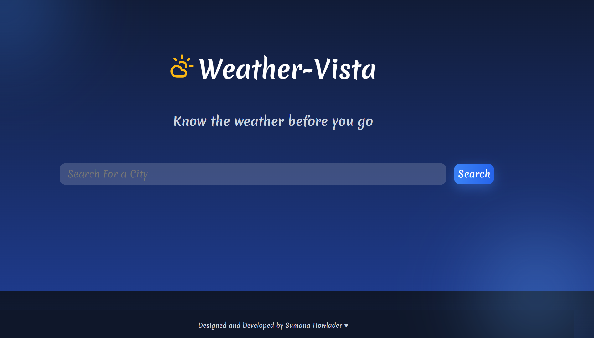
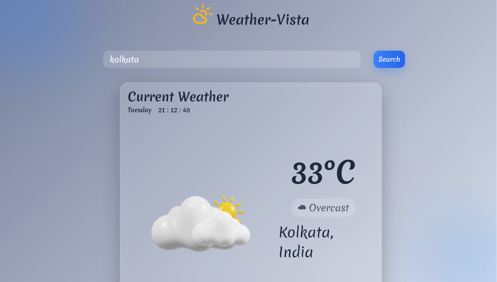
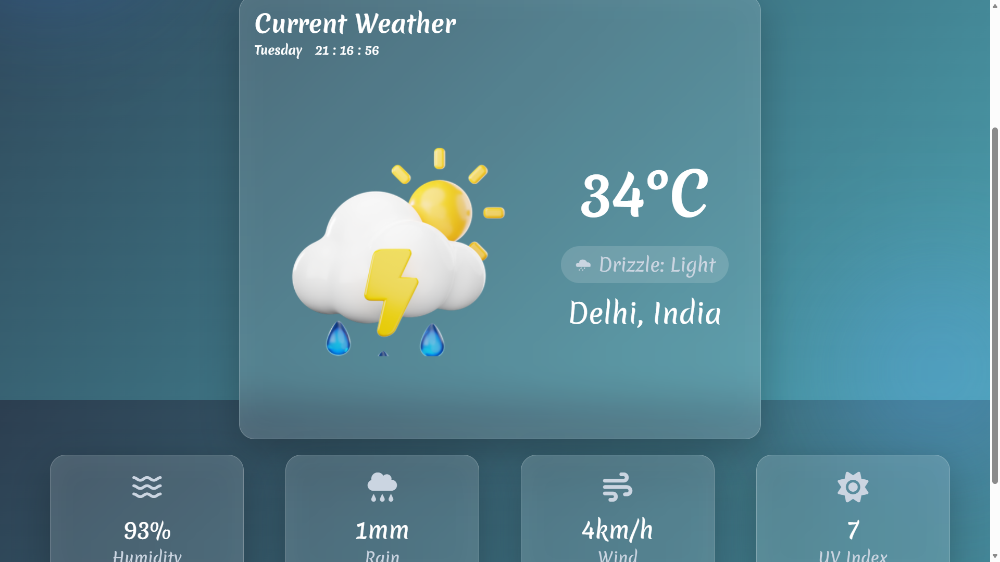
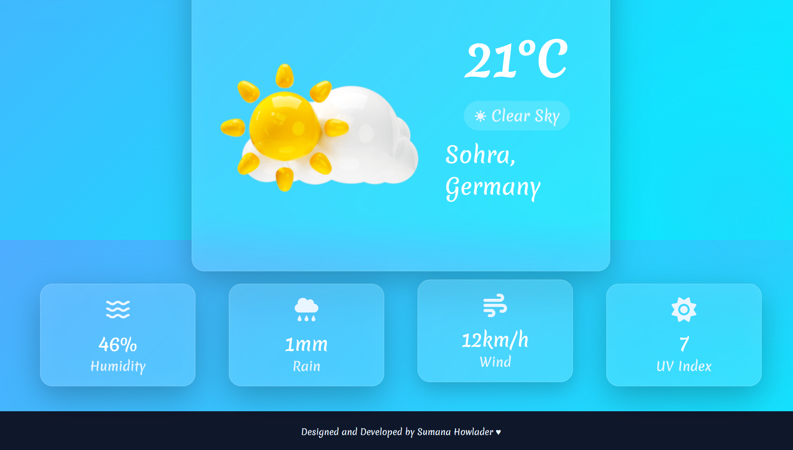

<!-- ===================================================== -->
<!--                     HERO SECTION                      -->
<!-- ===================================================== -->

<p align="center">

# 🌦️ Weather-Vista

### Modern • Responsive • Animated • Glassmorphism • Real-Time Weather


</p>

<p align="center">


</p>

---

# ✨ Experience Weather Like Never Before

A beautifully designed weather application built with **Vanilla JavaScript**, featuring immersive animated backgrounds, elegant glassmorphism, smooth transitions, animated statistics, and responsive layouts.

Unlike ordinary weather apps, this project focuses on delivering a premium user experience.

---

# 🚀 Live Demo

> 🔗 **(https://sumana9106-sketch.github.io/weather-vista/)**


---

# 📸 Preview

| Home |
|------|
|  |

| Search Result |
|------|
|  |

| Rain Theme |
|------|
|  |

| Sunny Theme |
|------|
|  |


---

# ⭐ Features

<table>

<tr>

<td width="50%">

## 🌍 Real-Time Weather

Search weather instantly for any city.

</td>

<td width="50%">

## 🎨 Dynamic Themes

Automatic background changes according to weather.

</td>

</tr>

<tr>

<td>

## ✨ Glassmorphism UI

Modern frosted glass interface.

</td>

<td>

## 📱 Responsive

Works beautifully on Desktop, Tablet and Mobile.

</td>

</tr>

<tr>

<td>

## 📈 Animated Statistics

Smooth counting animation for weather values.

</td>

<td>

## ⏰ Live Clock

Real-time digital clock with current day.

</td>

</tr>

<tr>

<td>

## 🌦️ Weather Icons

Weather-specific illustrations.

</td>

<td>

## ⚡ Fast Performance

Pure HTML, CSS & JavaScript.

</td>

</tr>

</table>

---

# 🎨 Supported Weather Themes

| Weather | Theme |
|---------|-------|
| ☀️ Sunny | Golden Sky |
| ☁️ Cloudy | Soft Grey |
| 🌧️ Rain | Deep Blue |
| ❄️ Snow | Ice White |
| 🌫️ Fog | Mist Grey |
| ⛈️ Thunderstorm | Dark Purple |

---

# 🛠️ Tech Stack

```text
HTML5

CSS3

JavaScript (ES6)

Open-Meteo API

Open-Meteo Geocoding API

Font Awesome
```

---

# 📂 Folder Structure

```text
Weather-Forecast
│
├── assets
│
├── screenshots
│
├── css
│
├── js
│
├── index.html
│
└── README.md
```

---

# ⚙️ Installation

```bash
git clone https://github.com/sumana9106-sketch/weather-vista.git
```

```bash
cd weather-vista
```

Open

```
index.html
```

That's it 🎉

---

# 💻 Project Highlights

✅ Dynamic Weather Backgrounds

✅ Animated Numbers

✅ Live Digital Clock

✅ Responsive Layout

✅ Smooth Page Animations

✅ Weather Illustration

✅ UV Index

✅ Wind Speed

✅ Humidity

✅ Rainfall

✅ Error Handling

✅ Loading Skeleton

---

# 📊 Performance

✔ Lightweight

✔ Fast Loading

✔ No Framework

✔ No Build Tool

✔ Pure JavaScript

✔ Mobile Friendly

---

# 🌟 Why This Project?

Most beginner weather apps simply display weather information.

This project focuses on **creating an engaging user experience** through:

- Premium UI
- Motion Design
- Smooth Animations
- Responsive Layout
- Elegant Glassmorphism
- Modern Colour Palette
- Real-Time Weather

---

# 🚀 Roadmap

- [ ] 7-Day Forecast

- [ ] Hourly Forecast

- [ ] Air Quality

- [ ] Sunrise & Sunset

- [ ] Favourite Cities

- [ ] GPS Weather

- [ ] Dark / Light Mode

- [ ] PWA Support

---

# 🤝 Contributing

Contributions are welcome!

```text
Fork 🍴

Clone 📥

Create Branch 🌿

Commit Changes ✅

Open Pull Request 🚀
```

---

# 💙 Show Your Support

If you liked this project,

please consider giving it a ⭐.

It motivates me to build more awesome open-source projects.

---

# 👨‍💻 Author

## Sumana Howlader

Computer Science Engineering Student

Frontend Developer

GitHub

LinkedIn

Portfolio (Coming Soon)

---

# 📬 Connect With Me

<p align="center">

<a href="https://github.com/sumana9106-sketch">

</a>

<a href="https://www.linkedin.com/in/sumana-howlader-804863377">

</a>

</p>

---

<details>

<summary>💡 How does the background change?</summary>

The application maps Open-Meteo weather codes to custom weather themes and updates the UI dynamically using CSS classes and transitions.

</details>

<details>

<summary>🌎 Which APIs are used?</summary>

Open-Meteo Forecast API

Open-Meteo Geocoding API

</details>

<details>

<summary>📱 Is it responsive?</summary>

Yes.

The application has been optimized for Desktop, Tablet and Mobile devices.

</details>

<details>

<summary>⚡ Why Vanilla JavaScript?</summary>

To demonstrate strong fundamentals without relying on frameworks.

</details>

---

<p align="center">

## ⭐ Thanks for visiting!

If you enjoyed this project, don't forget to leave a ⭐

Made with ❤️ by **Sumana Howlader**

</p>
